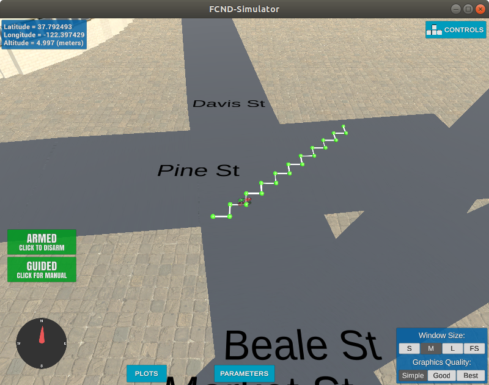
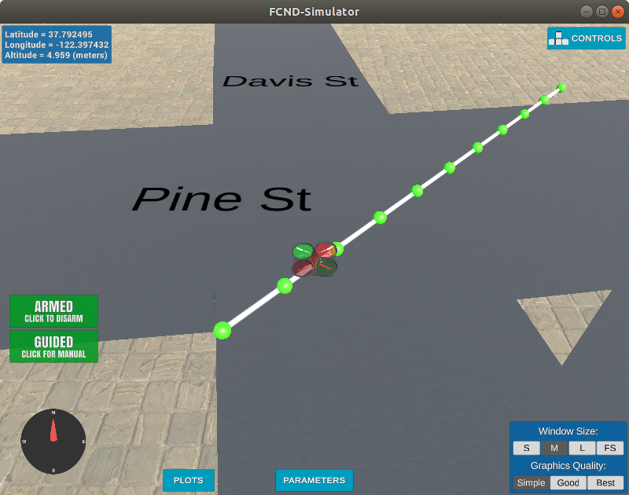
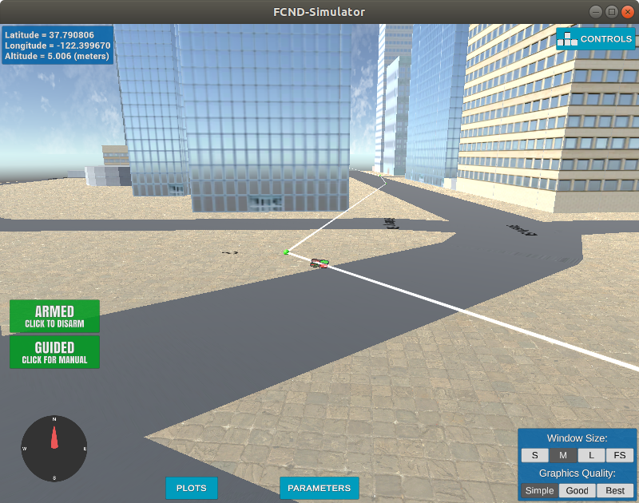

## Project: 3D Motion Planning

---

### Explain the Starter Code

The scripts `motion_planning.py` and `planning_utils.py` contain a basic planning implementation that includes code for the states and transitions of basic flight phases.

* arming
* takeoff
* planning
* flying
* landing
* disarming

Compared to `backyard_flyer_solution.py` the planning state is added and some setup functionality (like setting the home position) is moved to a new function called plan_path(). This new function handles the loading of a map, pathfinding and waypoint creation tasks.

The map is loaded from `colliders.csv` and a grid of 1m squares is generated, where each cell that contains an obstacle is marked. (`create_grid()` in `planning_utils.py`).

Then the A* algorithm is run to compute a path from a simple start and endpoint. The `a_star()` function from `planning_utils.py` is used here. It provides a basic implementation with up/down/right/left movements.
Since the start and end pont are (10/10) apart, the resulting path is a zig-zag line in diagonal direction.

The resulting waypoints are sent to the simulator for visualization and set as waypoints for the drone.

The result can be seen here, the drone is flying in a zig-zag path from start to destination.

### Implement Your Path Planning Algorithm

#### 1. Set your global home position

To load the home position i use `loadtxt()` (line 132 `motion_planning.py`) from numpy with the following arguments `("colliders.csv", delimiter=", ", dtype="str", max_rows=1)`. I get two strings that contain the descriptor and the value, i split those and convert to float.

`set_home_position()` sends the home position to the drone.

#### 2. Set your current local position

In line 141ff i retrieve the global position reading from `self.global_position` and convert it to a local position using `global_to_local()` which converts lat/lon position to utm coords relative to the home position.

#### 3. Set grid start position from local position

After generating the grid with `create_grid()` from `planning_utils.py` i set the start position in grid coordinates by subtracting the north and east offsets from the local position i just calculated.

#### 4. Set grid goal position from geodetic coords

In my code i generate a local goal position randomly and check that it not inside any obstacle using the grid.

Using global positions as goal seems to be more complicated and not necessary since the map is already in local coordinates. Converting a global position to grid coordinates is easy, using `global_to_local()` from `frame_utils.py` and subtracting the grid offsets.

#### 5. Modify A* to include diagonal motion (or replace A* altogether)

I modified the A* implementation to include diagonal motions by adding them to the Action class enum (l104ff) and modified the `valid_actions()` function to check for diagonal motions too (l134ff). For this, i added a small helper function `removeIfExists()` to remove a motion if it exists. Because diagonal motions could be removed multiple times using this approach. the `a_star()` function itself does not need any modifications for this.

The drone is flying a straight line now.

#### 6. Cull waypoints

To prune the path i use the python provided bresenham algorithm (`planning_utils.py` l16ff). I go through all waypoins once, remembering the last waypoint that i want to keep (A), the first one that i keep is the start point. For each waypoint (B) i check if the direct path from A to B has any cells that are output by bresenham contain an obstacle. If there is an obstalce i add B-1 to the path and set A to that one. After i went through all waypoints i need to add the last waypoint to the path.

#### 7. It works

The Drone is flying from start position to a randomly selected destination. Buildings in the environment are avoided and the the shortest route is chosen. Redundant waypoints are removed so the drone flies longer distance without stopping.

