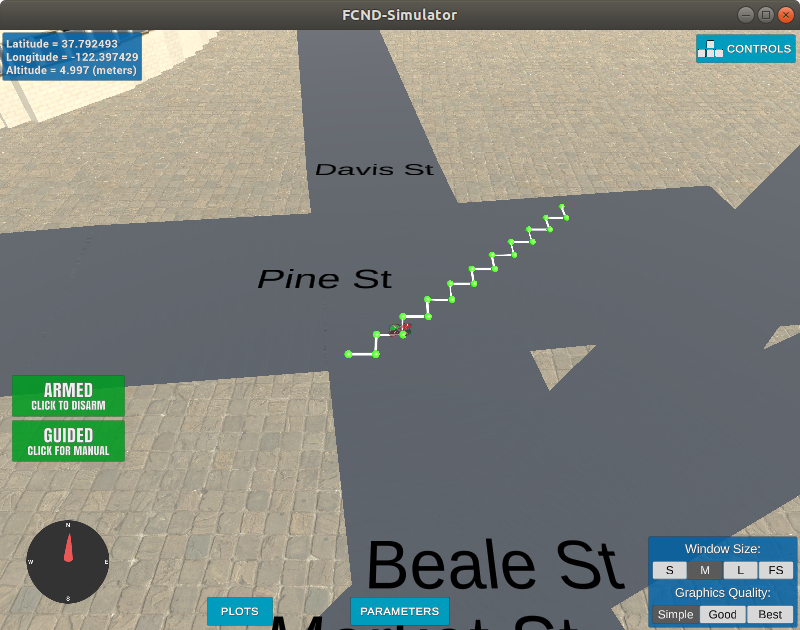
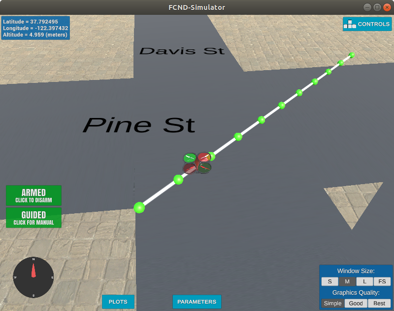
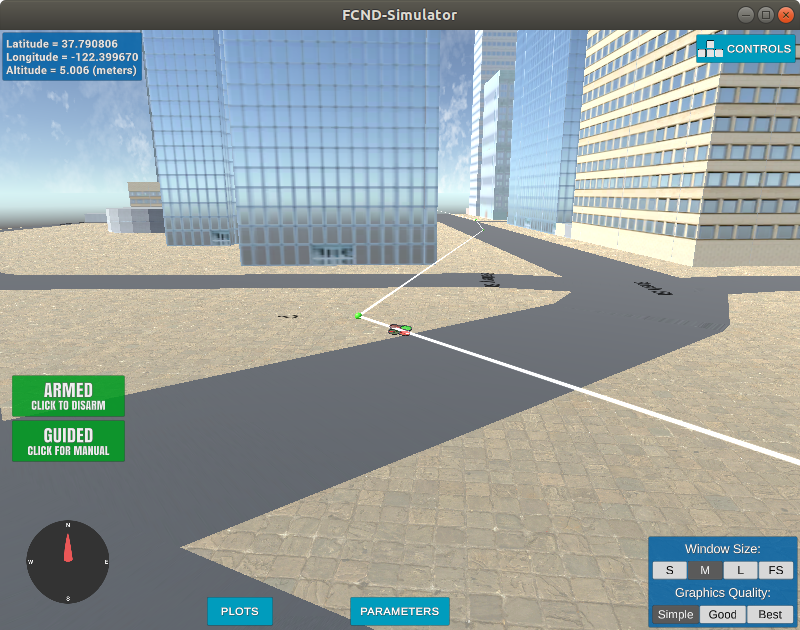

## Project: 3D Motion Planning

---

# Required Steps for a Passing Submission:

1. Load the 2.5D map in the colliders.csv file describing the environment.
2. Discretize the environment into a grid or graph representation.
3. Define the start and goal locations.
4. Perform a search using A* or other search algorithm.
5. Use a collinearity test or ray tracing method (like Bresenham) to remove unnecessary waypoints.
6. Return waypoints in local ECEF coordinates (format for `self.all_waypoints` is [N, E, altitude, heading], where the drone’s start location corresponds to [0, 0, 0, 0].
7. Write it up.
8. Congratulations!  Your Done!

## [Rubric](https://review.udacity.com/#!/rubrics/1534/view) Points

### Here I will consider the rubric points individually and describe how I addressed each point in my implementation

---

### Writeup / README

#### 1. Provide a Writeup / README that includes all the rubric points and how you addressed each one.  You can submit your writeup as markdown or pdf

You're reading it! Below I describe how I addressed each rubric point and where in my code each point is handled.

### Explain the Starter Code

#### 1. Explain the functionality of what's provided in `motion_planning.py` and `planning_utils.py`

These scripts contain a basic planning implementation that includes code for the states and transistions of basic flight phases.

* arming
* takeoff
* planning
* flying
* landing
* disarming

Compared to `backyard_flyer_solution.py` the planning state is added and some setup functionality (like setting the home position) is moved to a new function called plan_path(). This new function handles the loading of a map, pathfinding and waypoint creation tasks.

The map is loaded from `colliders.csv` and a grid of 1m squares is generated, where each cell that contains an obstacle is marked. (`create_grid()` in `planning_utils.py`).

Then the A* algorithm is run to compute a path from a simple start and endpoint. The `a_star()` function from `planning_utils.py` is used here. It provides a basic implementation with up/down/right/left movements.
Since the start and end pont are (10/10) apart, the resulting path is a zig-zag line in diagonal direction.

The resulting waypoints are sent to the simulator for visualization and set as waypoints for the drone.

The result can be seen here, the drone is flying in a zig-zag path from start to destination.

### Implementing Your Path Planning Algorithm

#### 1. Set your global home position

Here students should read the first line of the csv file, extract lat0 and lon0 as floating point values and use the self.set_home_position() method to set global home. Explain briefly how you accomplished this in your code.

To load the home position i use `loadtxt()` (line 132 `motion_planning.py`) from numpy with the following arguments `("colliders.csv", delimiter=", ", dtype="str", max_rows=1)`. I get two strings that contain the descriptor and the value, i split those and convert to float.

`set_home_position()` sends the home position to the drone.

#### 2. Set your current local position

Here as long as you successfully determine your local position relative to global home you'll be all set. Explain briefly how you accomplished this in your code.

In line 141ff i retrieve the global position reading from `self.global_position` and convert it to a local position using `global_to_local()` which converts lat/lon position to utm coords relative to the home position.

#### 3. Set grid start position from local position

This is another step in adding flexibility to the start location. As long as it works you're good to go!

After generating the grid with `create_grid()` from `planning_utils.py` i set the start position in grid coordinates by subtracting the north and east offsets from the local position i just calculated.

#### 4. Set grid goal position from geodetic coords

This step is to add flexibility to the desired goal location. Should be able to choose any (lat, lon) within the map and have it rendered to a goal location on the grid.

In my code i generate a local goal position randomly and check that it not inside any obstacle using the grid.

Using global positions as goal seems to be more complicated and not necessary since the map is already in local coordinates. Converting a global position to grid coordinates is easy, using `global_to_local()` from `frame_utils.py` and subtracting the grid offsets.

#### 5. Modify A* to include diagonal motion (or replace A* altogether)

Minimal requirement here is to modify the code in planning_utils() to update the A* implementation to include diagonal motions on the grid that have a cost of sqrt(2), but more creative solutions are welcome. Explain the code you used to accomplish this step.

I modified the A* implementation to include diagonal motions by adding them to the Action class enum (l104ff) and modified the `valid_actions()` function to check for diagonal motions too (l134ff). For this, i added a small helper function `removeIfExists()` to remove a motion if it exists. Because diagonal motions could be removed multiple times using this approach. the `a_star()` function itself does not need any modifications for this.

The drone is flying a straight line now.

#### 6. Cull waypoints

For this step you can use a collinearity test or ray tracing method like Bresenham. The idea is simply to prune your path of unnecessary waypoints. Explain the code you used to accomplish this step.

To prune the path i use the python provided bresenham algorithm (`planning_utils.py` l16ff). I go through all waypoins once, remembering the last waypoint that i want to keep (A), the first one that i keep is the start point. For each waypoint (B) i check if the direct path from A to B has any cells that are output by bresenham contain an obstacle. If there is an obstalce i add B-1 to the path and set A to that one. After i went through all waypoints i need to add the last waypoint to the path.

#### 7. It works

The Drone is flying from start position to a randomly selected destination. Buildings in the environment are avoided and the the shortest route is chosen. Redundant waypoints are removed so the drone flies longer distance without stopping.

### Double check that you've met specifications for each of the [rubric](https://review.udacity.com/#!/rubrics/1534/view) points

# Extra Challenges: Real World Planning

For an extra challenge, consider implementing some of the techniques described in the "Real World Planning" lesson. You could try implementing a vehicle model to take dynamic constraints into account, or implement a replanning method to invoke if you get off course or encounter unexpected obstacles.
